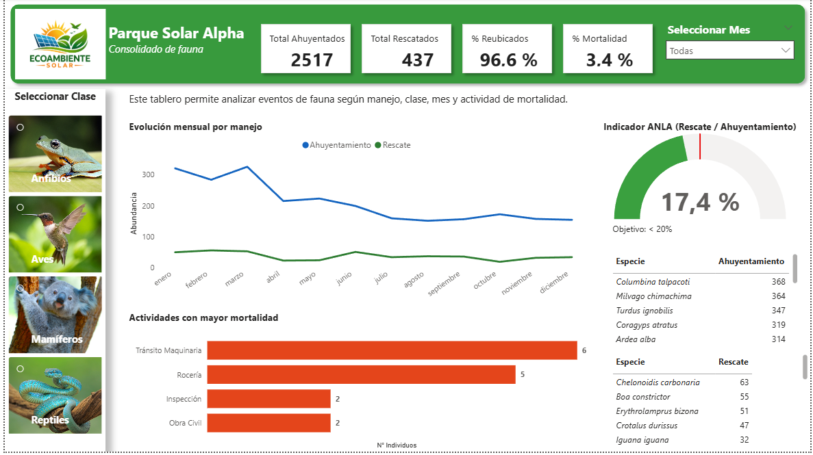

# 📊 Dashboard de Gestión de Fauna – Power BI

## 🎯 Objetivo

Analizar la gestión de fauna en proyectos ambientales, evaluando:

- Volumen de rescates y ahuyentamientos  
- Indicadores de reubicación y mortalidad  
- Cumplimiento del indicador ANLA  
- Especies y actividades críticas  

## 🧰 Herramientas utilizadas

- Power BI (visualización)  
- SQL (cálculo de KPIs)  
- Python (simulación de datos)  
- Excel (apoyo)  

## 📈 Principales insights

- La mayoría de individuos fueron gestionados mediante ahuyentamiento  
- La tasa de reubicación es alta (> 90%)  
- La mortalidad se concentra en actividades operativas específicas  
- Algunas especies concentran la mayor intervención  

## 📷 Vista del dashboard



## 📁 Estructura del proyecto

Este repositorio está organizado de la siguiente manera:

- **data/** → Datos fuente y archivos auxiliares (incluye `secciones.xlsx`)
- **pbix/** → Archivo del dashboard en Power BI  
- **sql/** → Consultas para cálculo de KPIs  
- **python/** → Scripts para generación y limpieza de datos  
- **images/** → Imágenes del dashboard para visualización en el README  

## 🧩 Archivo auxiliar (secciones)

Se utilizó un archivo adicional en Excel:

- **data/secciones.xlsx**

Este archivo contiene la relación entre la **clase taxonómica** y las **URLs de imágenes**, lo que permite construir un segmentador visual (slicer con imágenes) en Power BI.

### 🔗 Relación en el modelo de datos

- `registros[clase]` → `secciones[clase]`

### 🎨 Valor agregado

Este componente permite:
- Mejorar la experiencia de usuario  
- Facilitar la navegación visual del dashboard  
- Aportar un diseño más interactivo y profesional  

## 🌐 Versión Web Interactiva (HTML/CSS/JS + Supabase)

El dashboard cuenta con una versión web profesional desarrollada para presentaciones a clientes de consultoría ambiental:

### 🏗️ Arquitectura
- **Frontend**: HTML5 semántico, CSS3 moderno y Vanilla JavaScript con [Chart.js](https://www.chartjs.org/) para visualizaciones fluidas (gráfico de líneas temporal, barras horizontales de mortalidad y tacómetro ANLA semicircular).
- **Backend de Datos**: [Supabase](https://supabase.com/) con métricas pre-calculadas en tablas agregadas (`kpi_resumen`, `kpi_tendencia_mensual`, `kpi_mortalidad_actividad`, `kpi_top_especies`, `secciones_clase`).
- **Seguridad (Row Level Security - RLS)**:
  - Políticas de **solo lectura pública (`SELECT`)** con la clave `anon` del frontend.
  - Modificación e inserción de métricas restringida exclusivamente al script de backend con la clave secreta `service_role`.
- **Fallback Automático**: Si no se configuran credenciales en la nube, el dashboard opera automáticamente con el archivo `data/precalculated_data.json`.

---

## 🚀 Cómo usarlo

## ⚙️ Configuración de Variables de Entorno y Despliegue

El archivo `.env.example` sirve como plantilla para crear el archivo `.env` local con las credenciales de Supabase (`SUPABASE_URL`, `SUPABASE_ANON_KEY`, `SUPABASE_SERVICE_ROLE_KEY`).

Para sincronizar o actualizar los datos en Supabase y generar el respaldo local (`data/precalculated_data.json`), ejecuta el script `python/migrate_supabase.py` pasando las variables de entorno desde PowerShell.

El frontend web carga métricas en tiempo real desde Supabase mediante la clave pública `ANON` protegida con RLS, y cuenta con fallback automático al JSON local.

### 1. Dashboard Web
1. **Ejecución local inmediata**:
   ```bash
   python -m http.server 3000
   ```
   Abre tu navegador en `http://localhost:3000/index.html`.

2. **Pre-cálculo y migración a Supabase**:
   - Ejecuta el script SQL en el SQL Editor de tu proyecto Supabase: [`sql/supabase_schema.sql`](sql/supabase_schema.sql).
   - Configura las variables de entorno y migra los datos:
     ```bash
     set SUPABASE_URL=https://tu-proyecto.supabase.co
     set SUPABASE_SERVICE_ROLE_KEY=tu-service-role-key
     python python/migrate_supabase.py
     ```
   - Actualiza tu URL y `anon_key` en [`js/supabase-config.js`](js/supabase-config.js).

### 2. Dashboard en Power BI
1. Abrir el archivo `.pbix` en Power BI Desktop  
2. Actualizar datos si es necesario  
3. Explorar mediante filtros
  
